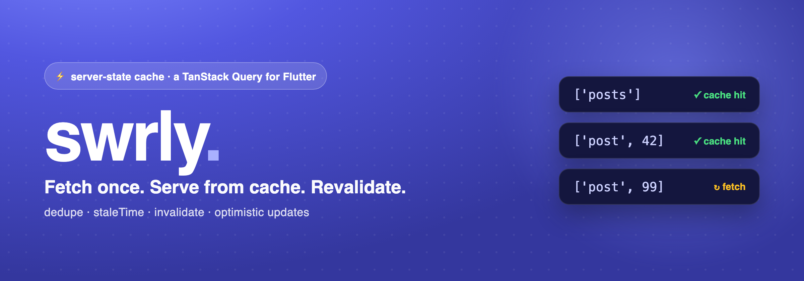
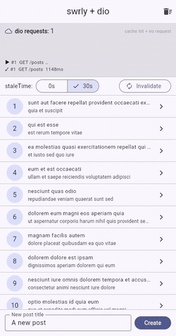

# swrly

<p align="center">
  
</p>

<p align="center">
  <a href="https://pub.dev/packages/swrly"></a>
  <a href="LICENSE"></a>
</p>

**Async data-fetching & server-state cache for Flutter** — dedupe requests,
cache by query key, serve instantly while revalidating in the background, and
invalidate on mutations. Inspired by [TanStack Query](https://tanstack.com/query)
and [SWR](https://swr.vercel.app/).

> **Status:** stable `0.1.x`; **`0.2.0` in prerelease** (`0.2.0-dev.N`) — adds
> retry+backoff, optimistic rollback, and `keepPreviousData`. Core cache
> semantics are covered by tests (100% line coverage on `lib/src`) and it runs
> on every platform (mobile, desktop, **web**).
>
> Trying the prerelease: `swrly: 0.2.0-dev.4` (pin exactly — prereleases aren't
> picked by `^` constraints).

### New in 0.2.0 (dev)

- **Retry + backoff** — per-query `retry`/`retryDelay` + client defaults
  (`defaultRetry`/`defaultRetryDelay`), exponential 1s→30s by default.
- **Optimistic updates with automatic rollback** — `MutationBuilder.onMutate`
  returns a rollback closure that runs automatically on failure.
- **`keepPreviousData` / `placeholderData`** — no loading flash on key change
  (search/pagination); `state.isPlaceholderData` marks the stand-in.

See [`CHANGELOG.md`](CHANGELOG.md) and [`doc/ROADMAP.md`](doc/ROADMAP.md).

## Why swrly?

**Server state** — the data you fetch from an API — behaves differently from the
**client state** your app owns (form inputs, toggles, navigation). It's shared,
it goes stale, and it wants deduping, background refetching, and invalidation
after writes. `swrly` is a small, focused cache for exactly that, modelled on
TanStack Query.

**Being honest about where it fits:**

- vs **`FutureBuilder`** — no contest: `FutureBuilder` has no cache (it re-runs
  on rebuild) and can't dedupe, share, or invalidate. `swrly` wins here easily.
- vs **Riverpod / Bloc** — these are excellent, and Riverpod's
  `FutureProvider.family` / `AsyncNotifier` *can* cache server state and
  `ref.invalidate` it. So `swrly` isn't "the only way." Its pitch is narrower
  and honest: a **dedicated** server-state cache with **stale-while-revalidate
  built in** (`staleTime`/`cacheTime`, request dedupe, optimistic writes), a
  familiar TanStack-Query API, and **no framework to adopt** — it's just an
  object you can drop into any app (including a Riverpod/Bloc one).
- vs a **dio cache interceptor** — that caches HTTP responses by URL; `swrly`
  caches app state by logical `queryKey` and also gives you loading/error/
  `isFetching`, invalidation, and optimistic updates (see the table below).

If you already live in Riverpod and are happy hand-rolling staleness/refetch on
async providers, you may not need this. If you want that behaviour out of the
box — or you're not on Riverpod — `swrly` is for you.

### You don't wrap `dio` — you just pass your call

`swrly` doesn't fetch anything itself and it's **not** an interceptor. You keep
using `dio` (or `http`, GraphQL, Firestore…) exactly as-is and hand `swrly` the
call as a `queryFn` plus a `queryKey`; it caches the result under that key. The
example app uses **dio** against a real API, with a live request counter so you
can *see* the cache working:

<p align="center">
  
</p>

The `dio requests` counter only moves on a real network call — watch it in the
breakdown below: re-opening the same post serves the detail **from cache (0
requests, instant)**, while a different post id is a separate cache entry:

| Real fetch (dio) | Re-open same key → cache hit | Different key → new fetch |
|---|---|---|
|  |  |  |

```bash
cd example && flutter run          # mobile / desktop
cd example && flutter run -d chrome # web (real dio calls to a public API)
```

## Install

```yaml
dependencies:
  swrly: ^0.1.0          # latest stable
  # swrly: 0.2.0-dev.4   # opt into the 0.2.0 prerelease (retry, rollback, keepPreviousData)
```

## How it works

```
QueryBuilder(queryKey, queryFn, staleTime)
        │
        ▼
  QueryClient looks up queryKey
        │
   fresh in cache?  ──yes──►  serve cached data instantly (no queryFn call)
        │no
        ▼
   a request already in flight for this key? ──yes──► await it (dedupe)
        │no
        ▼
   run queryFn (your dio call) ──► store result under queryKey ──► emit to widgets
```

- **`staleTime`** — how long data counts as *fresh*. Within it, re-reads are
  served from cache with **no** network call. After it, the next read refetches
  (while still showing the cached data — *stale-while-revalidate*).
- **`cacheTime`** — how long an unused entry stays in memory after its last
  `QueryBuilder` unsubscribes, before it's garbage-collected.

## Quick start

```dart
final dio = Dio();

QueryBuilder<List<Post>>(
  queryKey: const ['posts'],
  queryFn: () async => (await dio.get('/posts')).data
      .map<Post>(Post.fromJson).toList(),
  staleTime: const Duration(seconds: 30),
  builder: (context, state, refetch) {
    if (state.isLoading && !state.hasData) return const CircularProgressIndicator();
    if (state.isError && !state.hasData) return Text('Error: ${state.error}');
    return PostList(state.data!, refreshing: state.isFetching, onRefresh: refetch);
  },
)
```

Detail keyed by id — re-opening the same post is instant, a different id fetches
once:

```dart
QueryBuilder<Post>(
  queryKey: ['post', id],           // separate cache entry per id
  queryFn: () async => Post.fromJson((await dio.get('/posts/$id')).data),
  staleTime: const Duration(minutes: 1),
  builder: ...,
)
```

## Mutations

```dart
MutationBuilder<Post, String>(
  mutationFn: (title) async =>
      Post.fromJson((await dio.post('/posts', data: {'title': title})).data),
  onSuccess: (post, _) {
    // Optimistic write — show it instantly with no refetch:
    final current = QueryClient.instance.getQueryData<List<Post>>(['posts']) ?? [];
    QueryClient.instance.setQueryData<List<Post>>(['posts'], [post, ...current]);
    // …or invalidate to refetch from the server:
    // QueryClient.instance.invalidateQueries(['posts']);
  },
  builder: (context, mutate, state) => FilledButton(
    onPressed: state.isLoading ? null : () => mutate(title),
    child: Text(state.isLoading ? 'Saving…' : 'Save'),
  ),
)
```

**Optimistic update with automatic rollback (0.2.0)** — `onMutate` runs before
the request and returns a rollback closure that swrly runs for you if it fails:

```dart
MutationBuilder<Post, String>(
  mutationFn: createPost,
  onMutate: (title) {
    final prev = QueryClient.instance.getQueryData<List<Post>>(['posts']) ?? [];
    QueryClient.instance.setQueryData<List<Post>>(
        ['posts'], [Post.draft(title), ...prev]);   // show it instantly
    return () => QueryClient.instance
        .setQueryData<List<Post>>(['posts'], prev);   // auto-rollback on error
  },
  onSettled: (_) => QueryClient.instance.invalidateQueries(['posts']),
  builder: ...,
)
```

## How it compares

### vs `FutureBuilder`

| | `FutureBuilder` | `swrly` |
|---|---|---|
| Caching | ❌ re-runs the future on rebuild | ✅ cached by `queryKey` |
| Dedupe identical requests | ❌ | ✅ shares one in-flight request |
| Stale-while-revalidate | ❌ | ✅ `staleTime` |
| Invalidate after a write | ❌ (manual) | ✅ `invalidateQueries` |
| Share data across widgets | ❌ each has its own future | ✅ same key = same cache |

### vs Riverpod / Bloc / Provider

Fair comparison: Riverpod **can** do server-state caching —
`FutureProvider.family` caches by args and `ref.invalidate` re-runs it. So this
isn't "Riverpod can't." It's about **how much is built in vs hand-rolled**, and
whether you want a dedicated tool.

| | Riverpod async providers | `swrly` |
|---|---|---|
| Cache keyed by request args | ✅ `.family` | ✅ `queryKey` |
| Invalidate | ✅ `ref.invalidate` | ✅ `invalidateQueries` (prefix) |
| `staleTime` / stale-while-revalidate | hand-rolled | ✅ built-in |
| Request dedupe across widgets | ✅ | ✅ |
| Optimistic `setQueryData` + GC by subscription | hand-rolled | ✅ built-in |
| Requires adopting the framework | yes (providers everywhere) | no — just an object |

Rule of thumb: **already all-in on Riverpod and happy hand-rolling staleness?**
you may not need `swrly`. **Want TanStack-style server-state semantics out of the
box, or you're not on Riverpod?** reach for `swrly`. You can also use both —
Riverpod for client state, `swrly` for fetched data (its `QueryClient` is just
an object you expose however you like).

### vs a `dio` cache interceptor

A dio cache interceptor caches at the **HTTP layer** (by URL). `swrly` caches at
the **app-state layer** (by `queryKey`), so it also gives you loading/error
state, `isFetching`, dedupe across widgets, `invalidateQueries`, optimistic
`setQueryData`, and GC tied to widget lifecycle. Use dio for transport; `swrly`
for state.

## API at a glance

- **`QueryClient`** — the cache. `fetchQuery`, `invalidateQueries(prefix)` /
  `invalidateQueriesWhere((key) => bool)`, `setQueryData` / `getQueryData`,
  `removeQueries`, `clear`.
- **`QueryBuilder<T>`** — subscribes a widget to a key; rebuilds on state
  changes; auto-unsubscribes (drives GC). `enabled`, `refetchOnResume`,
  `retry` / `retryDelay`, `keepPreviousData` / `placeholderData`.
- **`MutationBuilder<T, V>`** — `mutate(vars)` with `onMutate` (optimistic +
  rollback) / `onSuccess` / `onError` / `onSettled`.
- **`QueryState<T>`** — `isLoading` / `isSuccess` / `isError`, `data`, `hasData`,
  `error`, `isFetching` (background refetch while data is present), and
  `isPlaceholderData`.

See [`doc/API.md`](doc/API.md) and [`doc/SPEC.md`](doc/SPEC.md).

## When *not* to use this

- **Pure client state** (form fields, toggles) → Riverpod / Bloc / `setState`.
- **A single fetch you never re-read or cache** → `FutureBuilder` is fine.
- **Offline-first persistence** → not yet (in-memory only; see limitations).

## Performance

Measured on an Apple M3 Pro (`flutter test`, JIT — an AOT release build is
faster):

| Cache op | throughput | notes |
|---|---|---|
| `getQueryData` | ~1.8–3.2 M/sec | hash-map lookup |
| `setQueryData` | ~160–240 K/sec | allocates the entry + stream + GC timer |
| `invalidateQueries` fan-out | ~0.3 µs / entry | linear; sub-ms for hundreds–thousands of keys |

Reads are effectively free; writes do real per-entry work. Invalidation scales
linearly with the number of cached entries (≈9 ms across 10 K, ≈32 ms across
100 K) — well beyond what a normal app holds.

Run it yourself: the example app has a **Stress test** screen (speed icon in the
AppBar) with a live FPS / build / raster / jank readout, a cache-ops
micro-benchmark, and hundreds of live `QueryBuilder`s under continuous
invalidation.

## Known limitations (0.1.x)

- **In-memory only** — no disk persistence / offline cache yet.
- No infinite/paginated query helper, no window-focus refetch (app-resume
  refetch is supported), no devtools. (Retry/backoff landed in 0.2.0-dev.)
- Cache is not yet persisted to disk (see above). (Optimistic writes now have a
  built-in rollback via `MutationBuilder.onMutate` — landed in 0.2.0-dev.)
- Cache keys must be primitives / lists / maps (structural equality); custom
  objects fall back to `toString()`.

## Where this is going

`swrly` grows with real use — the point is to erase the "hand-rolled" gaps so the
honest comparison keeps tilting in `swrly`'s favour.

**Shipped in 0.2.0-dev:** retry + backoff · optimistic rollback (`onMutate`) ·
`keepPreviousData` / `placeholderData` · predicate `invalidateQueries` (0.1.1).

**Still ahead:**

- **Robustness** — request **cancellation** when the last subscriber leaves
  (threads an abort token into `queryFn`), typed error surfaces.
- **Bigger features** — **infinite / paginated** queries, window/online refetch
  triggers.
- **Ergonomics** — non-widget `QueryObserver`, optional `flutter_hooks`
  `useQuery` / `useMutation`. (`useQueries` is intentionally skipped as too
  React-flavored; a type-safe record combinator is the preferred path.)
- **Persistence** — a pluggable adapter interface (hive / shared_preferences /
  drift) for offline-first caching.
- **Ecosystem** — a DevTools panel, and **Riverpod / Bloc** `AsyncValue`
  bridges.

Full detail and later milestones in [`doc/ROADMAP.md`](doc/ROADMAP.md).
Feedback and issues are very welcome — the roadmap is driven by what people
actually hit.

## License

MIT
