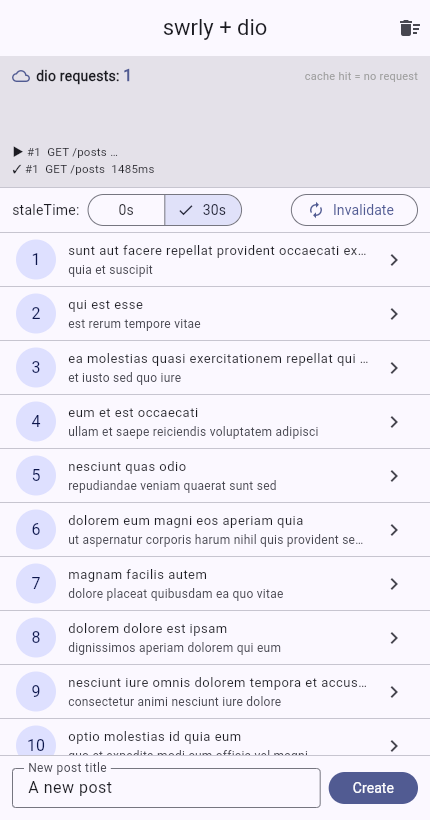
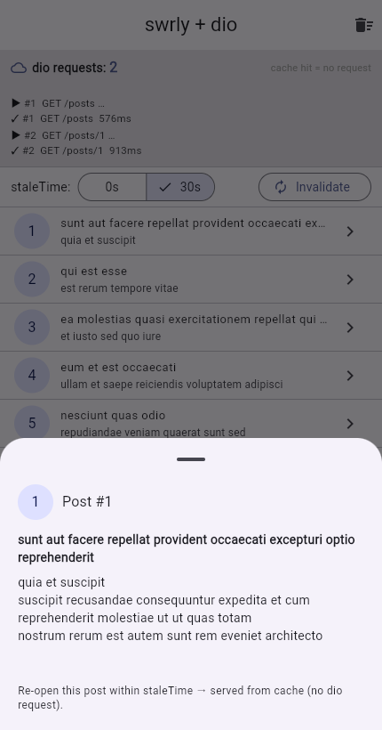
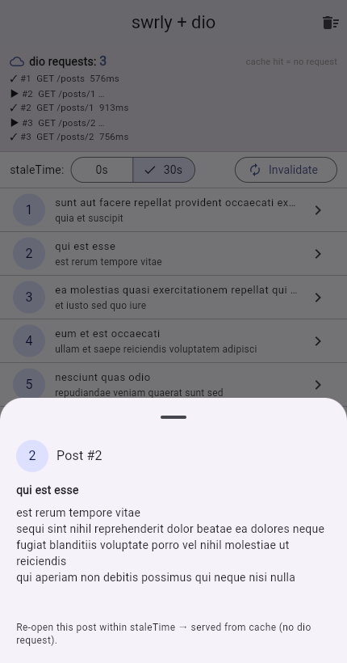

# swrly

[](https://pub.dev/packages/swrly)
[](LICENSE)

**Async data-fetching & server-state cache for Flutter** — dedupe requests,
cache by query key, serve instantly while revalidating in the background, and
invalidate on mutations. Inspired by [TanStack Query](https://tanstack.com/query)
and [SWR](https://swr.vercel.app/).

> **Status:** `0.1.0` — early but usable. Core cache semantics are covered by
> tests and it runs on every platform (mobile, desktop, **web**).

## Why swrly?

State managers like **Riverpod / Bloc / Provider** are built for **client
state** — the stuff your app owns (form inputs, toggles, navigation). But the
data on your **server** behaves differently: it's shared, it goes stale, it
needs deduping, background refetching, and invalidation after writes. Flutter
gives you `FutureBuilder` for a *single* fetch, but it has **no cache** — it
re-runs on every rebuild, can't dedupe, share, or invalidate.

`swrly` is the missing piece for **server state**: a keyed cache that sits
between your UI and your HTTP client.

### It works with your existing HTTP client (e.g. `dio`)

`swrly` doesn't fetch anything itself — you give it a `queryFn` (a `dio`/`http`
call) and a `queryKey`, and it caches the result under that key. The example app
uses **dio** against a real API, with a live request counter so you can *see*
the cache working:

| Real fetch (dio) | Re-open same key → cache hit | Different key → new fetch |
|---|---|---|
|  |  |  |

The `dio requests` counter only moves on a real network call. Re-opening a post
served the detail **from cache — 0 requests, instant**; a different post id is a
separate cache entry, so it fetches once. That's query-key-based caching.

```bash
cd example && flutter run          # mobile / desktop
cd example && flutter run -d chrome # web (real dio calls to a public API)
```

## Install

```yaml
dependencies:
  swrly: ^0.1.0
```

## How it works

```
QueryBuilder(queryKey, queryFn, staleTime)
        │
        ▼
  QueryClient looks up queryKey
        │
   fresh in cache?  ──yes──►  serve cached data instantly (no queryFn call)
        │no
        ▼
   a request already in flight for this key? ──yes──► await it (dedupe)
        │no
        ▼
   run queryFn (your dio call) ──► store result under queryKey ──► emit to widgets
```

- **`staleTime`** — how long data counts as *fresh*. Within it, re-reads are
  served from cache with **no** network call. After it, the next read refetches
  (while still showing the cached data — *stale-while-revalidate*).
- **`cacheTime`** — how long an unused entry stays in memory after its last
  `QueryBuilder` unsubscribes, before it's garbage-collected.

## Quick start

```dart
final dio = Dio();

QueryBuilder<List<Post>>(
  queryKey: const ['posts'],
  queryFn: () async => (await dio.get('/posts')).data
      .map<Post>(Post.fromJson).toList(),
  staleTime: const Duration(seconds: 30),
  builder: (context, state, refetch) {
    if (state.isLoading && !state.hasData) return const CircularProgressIndicator();
    if (state.isError && !state.hasData) return Text('Error: ${state.error}');
    return PostList(state.data!, refreshing: state.isFetching, onRefresh: refetch);
  },
)
```

Detail keyed by id — re-opening the same post is instant, a different id fetches
once:

```dart
QueryBuilder<Post>(
  queryKey: ['post', id],           // separate cache entry per id
  queryFn: () async => Post.fromJson((await dio.get('/posts/$id')).data),
  staleTime: const Duration(minutes: 1),
  builder: ...,
)
```

## Mutations

```dart
MutationBuilder<Post, String>(
  mutationFn: (title) async =>
      Post.fromJson((await dio.post('/posts', data: {'title': title})).data),
  onSuccess: (post, _) {
    // Optimistic write — show it instantly with no refetch:
    final current = QueryClient.instance.getQueryData<List<Post>>(['posts']) ?? [];
    QueryClient.instance.setQueryData<List<Post>>(['posts'], [post, ...current]);
    // …or invalidate to refetch from the server:
    // QueryClient.instance.invalidateQueries(['posts']);
  },
  builder: (context, mutate, state) => FilledButton(
    onPressed: state.isLoading ? null : () => mutate(title),
    child: Text(state.isLoading ? 'Saving…' : 'Save'),
  ),
)
```

## How it compares

### vs `FutureBuilder`

| | `FutureBuilder` | `swrly` |
|---|---|---|
| Caching | ❌ re-runs the future on rebuild | ✅ cached by `queryKey` |
| Dedupe identical requests | ❌ | ✅ shares one in-flight request |
| Stale-while-revalidate | ❌ | ✅ `staleTime` |
| Invalidate after a write | ❌ (manual) | ✅ `invalidateQueries` |
| Share data across widgets | ❌ each has its own future | ✅ same key = same cache |

### vs Riverpod / Bloc / Provider

They manage **client state**; `swrly` manages **server state** — they're
complementary, not competitors.

| | Riverpod / Bloc | `swrly` |
|---|---|---|
| Best for | Client state (UI, forms, nav) | Server state (fetched data) |
| Cache keyed by request args | do-it-yourself | ✅ built-in (`queryKey`) |
| Background refetch / staleness | do-it-yourself | ✅ built-in |
| Request dedupe + invalidation | do-it-yourself | ✅ built-in |

You can absolutely use both: Riverpod for app state, `swrly` for the data you
fetch. (`swrly`'s `QueryClient` is just an object — expose it however you like.)

### vs a `dio` cache interceptor

A dio cache interceptor caches at the **HTTP layer** (by URL). `swrly` caches at
the **app-state layer** (by `queryKey`), so it also gives you loading/error
state, `isFetching`, dedupe across widgets, `invalidateQueries`, optimistic
`setQueryData`, and GC tied to widget lifecycle. Use dio for transport; `swrly`
for state.

## API at a glance

- **`QueryClient`** — the cache. `fetchQuery`, `invalidateQueries(prefix)`,
  `setQueryData` / `getQueryData`, `removeQueries`, `clear`.
- **`QueryBuilder<T>`** — subscribes a widget to a key; rebuilds on state
  changes; auto-unsubscribes (drives GC). `enabled`, `refetchOnResume`.
- **`MutationBuilder<T, V>`** — `mutate(vars)` with `onSuccess` / `onError` /
  `onSettled`.
- **`QueryState<T>`** — `isLoading` / `isSuccess` / `isError`, `data`, `error`,
  and `isFetching` (a background refetch while data is present).

See [`doc/API.md`](doc/API.md) and [`doc/SPEC.md`](doc/SPEC.md).

## When *not* to use this

- **Pure client state** (form fields, toggles) → Riverpod / Bloc / `setState`.
- **A single fetch you never re-read or cache** → `FutureBuilder` is fine.
- **Offline-first persistence** → not yet (in-memory only; see limitations).

## Known limitations (0.1.x)

- **In-memory only** — no disk persistence / offline cache yet.
- No infinite/paginated query helper, no automatic retry/backoff, no
  window-focus refetch (app-resume refetch is supported), no devtools.
- `setQueryData` optimistic writes have no built-in rollback helper — handle
  `onError` yourself.
- Cache keys must be primitives / lists / maps (structural equality); custom
  objects fall back to `toString()`.

See [`doc/ROADMAP.md`](doc/ROADMAP.md).

## License

MIT
